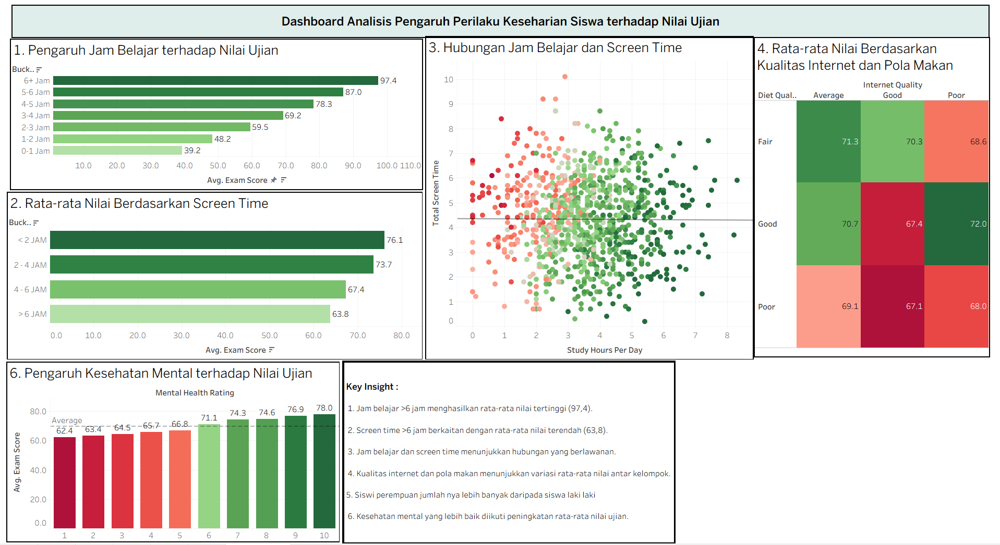

# student-behavior-dashboard
Interactive dashboard analyzing the relationship between students' daily behavior and exam performance using data visualization

# Student Behavior Dashboard

## 📊 Overview

This project presents an interactive data visualization dashboard that analyzes the relationship between students' daily behavior and their academic performance.

The dashboard explores how study hours, screen time, internet quality, diet quality, mental health, and gender distribution relate to students' average exam scores.

The project was created as part of a data analysis and visualization portfolio to demonstrate skills in data exploration, visualization, dashboard development, and insight generation.

---

## 🎯 Project Objectives

The main objectives of this project are:

- Analyze the relationship between students' study hours and exam scores.
- Examine the relationship between screen time and academic performance.
- Explore the relationship between study hours and screen time.
- Compare average exam scores based on internet quality and diet quality.
- Analyze the relationship between mental health ratings and exam scores.
- Understand the gender distribution within the dataset.
- Present analytical findings through an interactive dashboard.

---

## 🛠️ Tools & Technologies

- **Tableau** – Dashboard development and data visualization
- **Microsoft Excel / CSV** – Data preparation and data source
- **Data Visualization** – Charts, comparisons, and visual analysis
- **Data Analysis** – Exploratory analysis and insight generation

---

## 📈 Dashboard Analysis

The dashboard consists of several visualizations:

### 1. Study Hours vs Exam Score

This visualization compares students' average exam scores based on their daily study hours.

The analysis shows that students studying more than 6 hours per day achieved the highest average exam score of **97.4**.

### 2. Screen Time vs Exam Score

This visualization analyzes average exam scores based on students' daily screen time.

Students with less than 2 hours of screen time achieved the highest average exam score of **76.1**, while students with more than 6 hours had the lowest average score of **63.8**.

### 3. Study Hours and Screen Time

A scatter plot is used to visualize the relationship between students' study hours and total screen time.

The visualization provides an overview of how these two daily activities are distributed among students.

### 4. Internet Quality and Diet Quality

This heatmap compares average exam scores based on internet quality and diet quality.

The visualization highlights differences in academic performance across combinations of internet and diet quality.

### 5. Gender Distribution

A pie chart presents the distribution of students by gender.

The dataset contains:
- Female: **48.10%**
- Male: **47.70%**
- Other: **4.20%**

### 6. Mental Health vs Exam Score

This visualization compares average exam scores across different mental health ratings.

The dashboard shows an increasing pattern in average exam scores as the mental health rating increases.

---

## 💡 Key Insights

Based on the dashboard analysis:

1. Students studying more than 6 hours per day achieved the highest average exam score (**97.4**).

2. Students with more than 6 hours of screen time had the lowest average exam score (**63.8**).

3. Study hours and screen time show a visible distribution pattern that can be explored through the scatter plot.

4. Internet quality and diet quality are associated with variations in average exam scores across different groups.

5. Female students represent the largest gender group in the dataset, although the difference compared with male students is relatively small.

6. Higher mental health ratings are accompanied by higher average exam scores in the dashboard.

---

## 🖼️ Dashboard Preview

---

## 🔍 Skills Demonstrated

This project demonstrates the following skills:

- Data Analysis
- Exploratory Data Analysis (EDA)
- Data Visualization
- Dashboard Development
- Tableau
- Data Interpretation
- Insight Generation
- Analytical Storytelling
